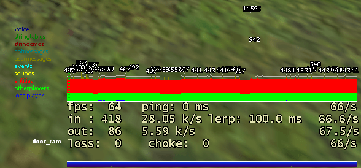
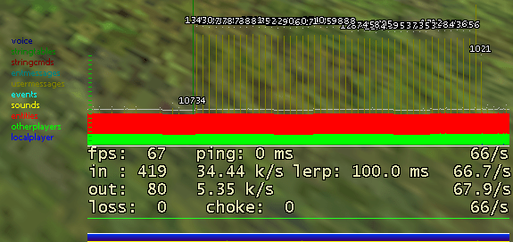
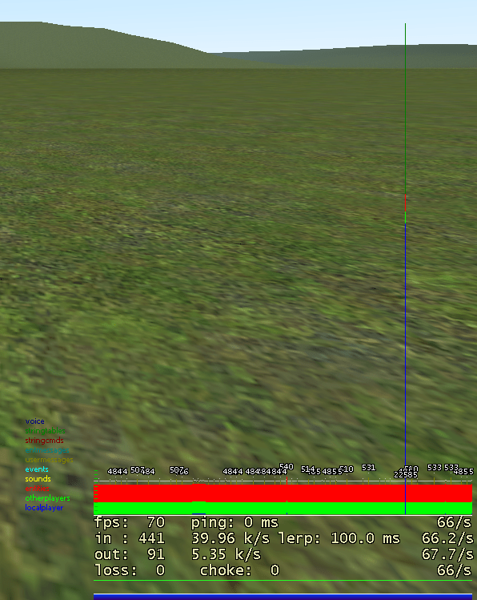
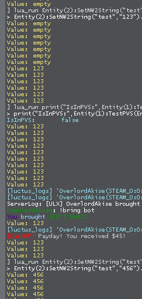

# Networking (net,nw,nw2)

This page shows more information on the networking systems in garrys mod.  
It is not supposed to be an introduction on how to use them or what functions exist within them.  
For this kind of information please visit the links provided in the Introduction chapter.


# Introduction

In Garry's Mod you can use 4 different networking systems to network data:

 - **net** , with e.g. `net.Send(ply)`
 - **NW** , with e.g. `ply:SetNWString("test","yes")`
 - **NW2** , with e.g. `ply:SetNW2String("test","yes")`
 - **umsg** , with e.g. `SendUserMessage("test",ply,"yes")`

As you can see, you need a player object to add information for 2 of those.  
This page will *NOT* go over usermessages, as they are obsolete and may get removed in a future update. Please do not use them!

To read more about networking in the official gmod wiki you can use the following links:

 - [https://wiki.facepunch.com/gmod/net](https://wiki.facepunch.com/gmod/net)
 - [https://wiki.facepunch.com/gmod/Net_Library_Usage](https://wiki.facepunch.com/gmod/Net_Library_Usage)
 - [https://wiki.facepunch.com/gmod/Entity:SetNWInt](https://wiki.facepunch.com/gmod/Entity:SetNWInt)
 - [https://wiki.facepunch.com/gmod/Entity:SetNW2Int](https://wiki.facepunch.com/gmod/Entity:SetNW2Int)
 - [https://wiki.facepunch.com/gmod/usermessage](https://wiki.facepunch.com/gmod/usermessage)
 - [https://wiki.facepunch.com/gmod/Networking_Usage](https://wiki.facepunch.com/gmod/Networking_Usage)

All 3 of the main methods are, according to their source, defined in C instead of LUA:

```lua
print(debug.getinfo(net.Send).short_src)
-- [C]
print(debug.getinfo(Entity(1).SetNWFloat).short_src)
-- [C]
print(debug.getinfo(Entity(1).SetNW2Float).short_src)
-- [C]
```

From all of the 4 mentioned methods of networking, only one allows a player to send data to the server: The `net` library.  
The `NW`, `NW2` and `umsg` libraries all only allow the server to send data to players and not the other way around.  

This means that, if you need to let players send data to the server, you have to use `net` messages.  


## Summary, Best practice

(This is my subjective opinion from all the facts on this page. This is the only subjective paragraph.)

If you want the most "performance", efficiency and control then it is recommended to mainly use the `net` library.  
This takes more code and checks to use, but is the most efficient networking you can do. If you create your own server then it is also recommended to create your own mini networking library which "overwrites" the default `:SetNWInt` functionality with your custom `net` based one. This way you don't have to redefine your networking method in every addon.

If you only need a variable to be seen if a player is close to another one, e.g. a variable if a hat should be displayed above their head, then you can use the `NW2` library. It is a bit shrouded in mystery, as nobody can explain how it works in detail, but it does not use many resources and works consistently. The NW2 system is also good enough that you can use it instead of a net message, as it is "optimized" for proximity-based networking, which you would have to do manually with the net message system.

The `NW` system should only be used if you don't use many network variables. It networks them to every player every 5-10 seconds, which creates a lot of networking load. This also delays future `:SetNWInt` function calls because they have to wait in line until the regularly-sent updates are done.  
Using this system is not as bad as everyone makes it out to be, but it is neither efficient nor very controllable.

The `usermessage` library should not be used ever. It is deprecated.


## net library

In the `net_graph 3` a big net message is shown by an "invisible" pillar:



For the above example I used the following code:
```lua
net.Receive("bbb",function()
    local a = net.ReadTable()
end)
if SERVER then
    util.AddNetworkString("bbb")
    net.Start("bbb")
        local aaa = {}
        for i=1,1000 do
            table.insert(aaa,math.random(1,9999999))
        end
        net.WriteTable(aaa)
    net.Send(Entity(1))
end
```

This is the most manual but also most efficient library for networking.  
It allows you to directly specify what data you want to send, in what format and to what players.  
This allows for even better optimization of for example networking numbers, because you can exactly specify how many bits you want to network.  
This means for a small ENUM you can only send 4 bits of data to players, which cuts down network usage in comparison to sending full 32bit numbers.

The only disadvantage of using the net library: Lots of manually written code.  
In comparison to the NW and NW2 systems you have to write your own code for sending data to every player.  
The data you send is also not automatically sent to newly joined players, which means you have to write an extra mechanism to network all the necessary data to a player if he joins and is able to receive data.  

To read more about this problem you can visit [https://wiki.facepunch.com/gmod/GM:PlayerInitialSpawn](https://wiki.facepunch.com/gmod/GM:PlayerInitialSpawn).  
Ofcourse this problem is now solved with other hooks (e.g. ClientSignOnStateChanged), but many addons still use the clientside InitPostEntity method.

This is not a major problem though, as the only downside to using the net library is more lines of code.  
It still is a place for errors to occur though, if someone new to coding in gmod is using the net library without research.


## nw library

The "regularly" updates that it sends every few seconds can be seen in the `net_graph 3` via the "usermessages" dark-yellow color:



For the above example I used the following code:
```lua
for i=1,2000 do
    Entity(1):SetNWString(i.."t",math.random(1,99999).."t")
end
```

The `NW` system updates all variables over time and not at once, which means the network graph looks more like a "comb" instead of a single spike.  
This also means that, if you set a lot of NW vars at once, it takes a few seconds to network them all to every player.

The NW library can be used to easily set a variable on a player that gets automatically send to every player on the server.  
The only problem: These variables get send to every player in a regular interval. This means that even if you change the value only once, it still gets sent out to every player every ~10 seconds.

If you have many NW variables this could create a lot of unnecessary load on your server. But on the other side, if you don't have many NW variables or don't have e.g. long string variables then it is completely OK to use them in your addons.

The advantage of using this library is: You can be lazy. 
By simply calling `ply:SetNWInt("blood",16)` the system automatically does the following for you:

 - Sets the variable
 - Sends the variable to every player on the Server
 - Sends the variable to newly connected players
 - Makes sure it is up to date
 - Deletes it after the player leaves

All of the above does not require any additional code, which makes it quite easy to use and perfect for "quick and lazy" implementation of networking data to players.

If you are a minimalist and only use one `NWInt` variable then it won't make a big difference to performance.  
But if you have 30 different `NWString`s for each illness a player could have then it is highly recommended to switch to a different networking method.


## nw2 library

Setting many variables at once shows a single, very big message in `net_graph 3` with multiple colors:



For the above example I used the following code:

```lua
for i=1,2000 do
    Entity(1):SetNW2Int(i.."t",math.random(1,99999))
end
```

The dark-green "stringtables" part of the network message is only present upon first setting a value to a key. It is absent if you set a new value to an already-set key.  
This, in comparison to NW2, only networks a value if it is changed. After setting these 2000 NW2Ints once it never showed up in the net_graph again.

According to the wiki a variable set with NW2 (e.g. using `ply:SetNW2Int`) is only networked to a player if he is in your PVS. A PVS is a "Potentially Visible Set" and basically means "something a player could see". ([https://developer.valvesoftware.com/wiki/PVS](https://developer.valvesoftware.com/wiki/PVS))  
According to my tests this seems to be wrong: Even if a second player is on the other side of the map, the value of a NW2 set variable is networked to me after a few seconds.

I tested this by printing the value of Player2's NW2String every second and changing it while I, Player1, was on the other side of the map, outside of his PVS. Result:



The code that prints the NW2String:  
```lua
timer.Create("aaa",1,0,function() print(Entity(2):GetNW2String("test","empty")) end)
```

As you can see in the above screenshot Player1 was not in the PVS but still received the NW2 update of Player2 after a delay. In the lower half of the screenshot you can see me teleporting the Player2 to me and changing the value again, this time updating instantly because Player2 was in my (Player1) PVS.

This means that a NW2 variable does not *ONLY* update if the player is in your PVS, it also updates irregularly on its own.


# FAQ


## Testing SetNW* sometimes not networking

Someone told me that a problem of the `NW` networking system is that "Sometimes a NWInt is not networked at all".

I tested this by setting 3000 `NWInt`s and then verifying that the client and server have the exact same values.  
For this to work correctly we have to wait for all 3000 variables to be networked though, as the `NW` system networks all variables over time and not at once.

The test was carried out by setting the variables, then waiting for it to finish networking, then saving all vars in a text file and comparing them.

The Code:
```lua
if SERVER then
    for i=1,3000 do
        Entity(2):SetNWInt(i.."t",math.random(1,999999))
    end
    timer.Simple(5,function()
        local tab = {}
        for i=1,3000 do
            table.insert(tab,Entity(2):GetNWInt(i.."t"))
        end
        file.Write("_s.txt",util.TableToJSON(tab))
    end)

else
    timer.Simple(5,function()
        local tab = {}
        for i=1,3000 do
            table.insert(tab,Entity(2):GetNWInt(i.."t"))
        end
        file.Write("_c.txt",util.TableToJSON(tab))
    end)
end
```

The result: If you compare the files with e.g. the linux `diff` command it shows 0 changes, which means both server and client have exactly the same values.

This result does not deny that there could be a delay in setting NW variables, as it is networked over time. This result just shows that every variable is correctly networked after some time.
