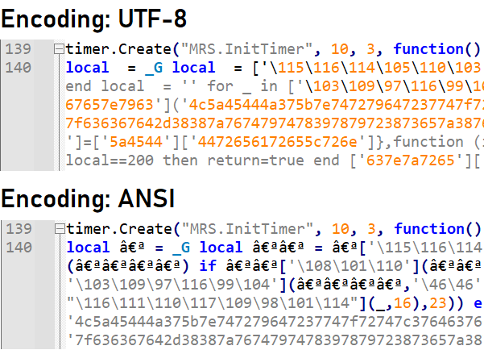

# About obfuscation

# Intro

Obfuscating something means "to make something difficult to see or understand".  
Obfuscation is not encryption.  
This is used in programming to hide the purpose of a piece of code so that a third party can not understand it.  
The main usage of this is to hide either malicious code or to hide DRM (Digital Rights Management, aka. anti-theft measurements).

# Warning

The method for the "xor" obfuscation is named "decrypt" but this is NOT REAL ENCRYPTION.  
Everyone can very easily deobfuscate any and all code. This is because the code has to be run in lua, which means LUA has to understand it, which means we can also understand it.  

The ASCII and ANSI obfuscation methods explained below are not "encrypting" anything, they are just hiding code by changing how it is displayed.  
The xor method has the decryption key and function available in the obfuscated code.  
A good example: If I give you a box with a lock on it and then give you the key too, is the box really secured? No, because you have the key.

# Examples in gLUA

The main obfuscation methods people use in gmod are ascii escaped strings, invisible ANSI characters and a simple xor "encryption".


## ASCII string obfuscation

The easiest way to make code unreadable is to convert the function and variable names to "ascii escaped strings". (I am unsure if that is the correct term)

The example function before being unreadable:

```lua
print(math.random())
```

The above function simply prints a random number.  
To make it unreadable we can use the _G global variable and its indexes instead of the function names directly:

```lua
_G["\112\114\105\110\116"](_G["\109\97\116\104"]["\114\97\110\100\111\109"]())
```

This is the same function as above and will print a random number no matter if you execute it in lua, luajit or glua.

**Explanation**

You can write a single character via its ascii representation.  
The capital letter A is ascii decimal 65 or ascii hex 41.  
This means to print the letter A you can use either of the following lines of code:

```lua
print("A")
print("\65")
print(string.char(65))
print("\x41")
```

All the 4 above lines will print a capital A, but only one of those is easily readable.

To make the function names unreadable too we use the _G variable. It has every global variable and itself inside of it.  
Every global lua function and variable is an index of _G. This means the print function can be called by either using `print` or `_G.print` or `_G["print"]`.  
We can combine the above "ascii string" method with this. The following 3 lines all print the capital letter A:

```lua
print("A")
_G.print("A")
_G["print"]("A")
_G["\112\114\105\110\116"]("A")
_G["\112\114\105\110\116"]("\65")
```

This makes the code now fully unreadable until you deobfuscate it.


## xor obfuscation

This method uses the bit.bxor to turn a string of "hex char-pairs" into a readable string again.

An example of such a function call:

```lua
local a = _G
local b = function(text) --[[ decrypt text ]]--

a[b'7f636367']
```

In the above example the variable `a` is _G and `b` is the decryption function. This means that the function in the last line is a global function that gets called from _G.  
The encryption function doesn't need brackets around it, which means the decryption function `b` gets the hex code behind it.  

The decryption function is nearly always the same as this:

```lua
local function decrypt(input)
    local output = ""
    for _ in string.gmatch(input,"..") do
        output=output..string.char(bit.bxor(tonumber(_,16),23))
    end
    return output
end
```

This decrypt function does the following:
 - The string.gmatch function returns a list of found substrings
 - The ".." argument fills this list with 2-character pairs, which is normal for hex
 - The main line that adds the output together converts this hex-char-pair to a number and does a "bitwise xor" on it with 23 before turning it into a single character

If you execute this function with the input of the example above it (`'7f636367'`) it returns the string `"http"`, which means the function that it returns is the http function (used for http.Fetch and http.Post).

This above decryption function is (nearly always) obfuscated with the "ASCII string" method mentioned above.


## Invisible ANSI characters

The 2 methods above now make code unreadable, but not completely confusing yet.  
This is why every obfuscation uses "invisible" characters as variable names.

To better show this example have a screenshot:



As you can see in the above screenshot, the code seems to have no variable names with the default utf8 encoding that is used by Notepad++.  
If you go to "Encoding" -> "ANSI" at the top you can change it and see those invisible variables. All variables are a single character (or 2) repeated a varying number of times.

There is nothing more to this except hiding the variables to confuse and deviate people from de-obfuscating the code.


# Deobfuscation

I currently do not know of any tools that can deobfuscate lua code, if I have to I do it by hand which is quite easy.

The invisible ANSI characters can be replaced with normal variable names by using the search&replace method found in every code editor.  
In Notepad++ you can press CTRL+H, tick the "Match whole word only" box and search for the string you want to replace with your custom variable name.

The ASCII and xor obfuscation can be easily deciphered like that aswell.  
Have a lua console open and simply print the `\65\65` strings to get their actual text representation and replace it in the code.  
Example:

```lua
> print("\112\114\105\110\116")
print
```

The above example shows that the `"\112\114\105\110\116"` can be replaced with `print` in the code you want to deobfuscate.  
Same can be done with the xor decrypt method.


# My experience

I know that atleast the "Military Rank System" and "Xeon" addons use these methods of obfuscation.  
They use all 3 methods at once and are thus very easy to deobfuscate.

Most if not all addons that are released somewhere use either none or these 3 methods for obfuscation.  
These are normally enough to deter anyone from deobfuscating it.  
You can not make code "undecryptable", because the client has to execute the code, which means atleast the client has to make it "executable", which means we can grab that executable code and make it ours.

To deobfuscate the MRS addon it took around 30 minutes and I only had to do it because the creator obfuscated the (in my opinion very important) "SetupRankData" function.

Do not use obfuscation to "secure" your code or save it from being stolen, because it doesn't help against that. One talented person can deobfuscate any and all code you have ever uploaded in a week max. Obfuscation is not encryption.
