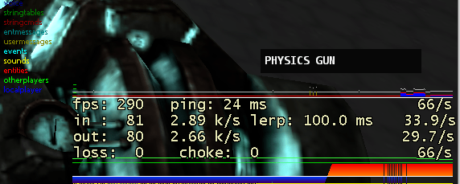
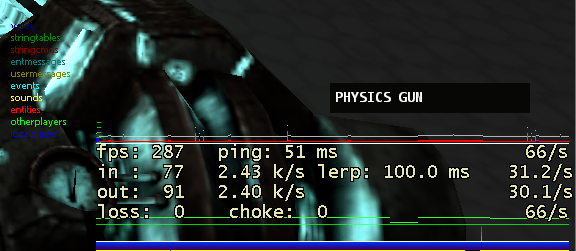

# Find and fix lag

## Identify the realm

Lag is not always caused by the same problem on the same side.

To be able to identify where the lag is hapening I highly recommend you to enable the network graph.  
You can do this by using the `net_graph 3` console command ingame on the client.

### Serverside lag

Serverside lag is easily identified by: Having high FPS and being teleported back if you try to move.  
The net_graph will show the following if the server is lagging:

As you can see, the blue graph at the bottom of the network graph goes above the white line and becomes red, meaning the server is lagging behind.

During these times you will notice gameplay but not display lag. This means your FPS are high and the mouse movement is normal, but hitting players or interacting with the world becomes difficult/impossible.

### Clientside lag

Clientside lag is easily identified by: Your screen freezing or your FPS being low.  
The net_graph will show the following if your game is lagging:

You can see a thin, white line at the bottom of the network graph. This will be interrupted if your game freezes, making it easily visible if you or the server had lag.

This white line will be dotted if you tab out, because it represents your "local tickrate" and if it becomes less than the configured one (DarkRP normally uses 33 ticks, if you tab out you have 15) then it will look like lag too. This is normal though and does not have any negative side effects. Ofcourse you should be able to "satisfy" the server tick rate to have a smooth gameplay experience, so having more FPS than the tickrate is desirable.

## Find the lag

The easiest way to find the addon that causes lag is done with the "Divide and Conquer" method.

If you are either not a developer or have no idea where the root cause of the lag is coming from then you can remove addons and check if the lag is still there.

First you either remove all workshop addons (by not loading the workshop collection) or remove all addons in the garrysmod/addon folder.  
Then you check if the lag is still there. If yes then the "bad addon" must be in the addons that are still loaded. If the lag is gone then the cause of the lag is in the addons that were not loaded.

This way you always remove half of the possible candidats everytime you test it, making the process of finding the culprit way faster.

### Identify the cause

You always have to check where and when the lag happens to be able to fix it.

Does it happen after a specific event (e.g. job change, player spawns, player joins, etc.) or does it happen randomly?  
If it happens randomly, does it happen on a nearly fixed interval (e.g. every ~5minutes) or completely random?  
Does it happen with many players online or even with a single person?

These are all important things to note down.  
Examples on how to fix these issues:
 - If it happens on a fixed interval then check your timer.Create function calls
 - If it happens during an event like when a player spawns then check your hooks for that (e.g. PlayerSpawn)

With these 2 you are always able to find and fix the lagging functions.

I sadly can't provide a more detailed explanation here, you will have to ask your developer for more.
